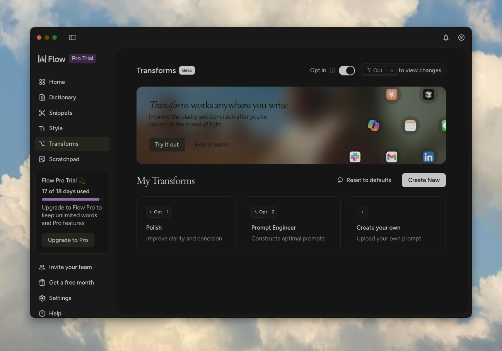

<h1 align="center">
  Wispr Flow Dark-Smokey
</h1>

<h4 align="center">A one-command dark theme for <a href="https://wispr.com/" target="_blank">Wispr Flow</a> on macOS and Windows — neutral, clean, and easy to live with.</h4>

<p align="center">
  <a href="https://github.com/ll1li/wispr-flow-dark-smokey/blob/main/LICENSE">
    
  </a>
  
  
  
</p>

<p align="center">
  <a href="#why">Why</a> •
  <a href="#install">Install</a> •
  <a href="#usage">Usage</a> •
  <a href="#how-it-works">How It Works</a> •
  <a href="#compatibility">Compatibility</a> •
  <a href="#license">License</a>
</p>

<p align="center">
  
</p>

---

## Why

Wispr Flow ships with a hardcoded white UI and no dark mode option. If you use it at night, the default window is hard to ignore. This project patches Wispr Flow's Electron `app.asar` bundle to inject a neutral dark theme: dark without a strong colour cast, static instead of animated, and easy to apply or undo.

## Features

| | |
|---|---|
| **Neutral dark tone** | `invert(.91) hue-rotate(180deg) brightness(.93)` — deep dark without a colour cast |
| **Zero GPU overhead** | No animated overlays, no atmospheric layers — static CSS only |
| **Anti-flashbang** | Dark backstop on `<html>` and `<body>` prevents bright white flashes during startup and navigation |
| **Uniform dark surfaces** | Overrides internal CSS variables so sidebar, content, and modals all match |
| **Natural media** | Images, video, and canvas are counter-inverted so they render correctly |
| **Atomic write** | Patches via temp file + rename, with size verification — never leaves a corrupt bundle |
| **Idempotent** | Strips prior patches (any v1.x marker variant) before injecting; safe to re-run anytime |
| **Fast `--check`** | Reads asar bytes directly — no extract, ~100× faster than v1.3.x |
| **One-command restore** | `--restore` reverts to the original in seconds |

## Install

### macOS

One-line install:

```bash
curl -fsSL https://raw.githubusercontent.com/ll1li/wispr-flow-dark-smokey/main/install-macos.sh | bash
```

The installer places `wispr-flow-dark-smokey` in `/usr/local/bin`, which is already on the default `PATH` on most macOS systems. It uses `sudo` only if needed.

> **Manual install:** download `wispr-flow-dark-smokey` to `/usr/local/bin/` and make it executable.

### Windows

One-line install (works in PowerShell 7+ and the built-in PowerShell 5.1):

```powershell
iwr -useb https://raw.githubusercontent.com/ll1li/wispr-flow-dark-smokey/main/install-windows.ps1 | iex
```

The installer drops `wispr-flow-dark-smokey.ps1` and `wispr-flow-dark-smokey.cmd` into `%USERPROFILE%\.local\bin\` and prints a one-liner to add that directory to your user `PATH` if it isn't already there.

After install, you can run `wispr-flow-dark-smokey` from PowerShell, cmd, Windows Terminal, or any launcher — the `.cmd` shim forwards everything to PowerShell transparently.

> **Manual install:** download `wispr-flow-dark-smokey.ps1` and `wispr-flow-dark-smokey.cmd` to a directory on your `PATH` and you're done. No build step.

## Usage

```bash
wispr-flow-dark-smokey            # Apply the dark theme (auto-restarts Wispr Flow)
wispr-flow-dark-smokey --restore  # Revert to the original
wispr-flow-dark-smokey --check    # Check whether the theme is currently applied
wispr-flow-dark-smokey --version  # Print version
wispr-flow-dark-smokey --help     # Show all options
```

The same flags work on Windows. PowerShell-native style is also accepted (`-Restore`, `-Check`, `-Version`).

**Custom install path:** Set `WISPR_PATH` to override the default Wispr Flow location:

```bash
# macOS
WISPR_PATH="/path/to/Wispr Flow.app" wispr-flow-dark-smokey

# Windows (PowerShell)
$env:WISPR_PATH = "D:\Apps\WisprFlow"; wispr-flow-dark-smokey
```

> Wispr Flow auto-updates silently overwrite the patch on macOS, and create a new versioned install directory on Windows. Just re-run `wispr-flow-dark-smokey` after any app update.

## Updating

Wispr Flow updates overwrite the patch on macOS and create a new versioned install directory on Windows. After any Wispr Flow update, just run `wispr-flow-dark-smokey` again.

## Restore / Uninstall

To remove the theme and go back to the original app bundle:

```bash
wispr-flow-dark-smokey --restore
```

To remove only the installed command:

* macOS: delete `/usr/local/bin/wispr-flow-dark-smokey`
* Windows: delete `wispr-flow-dark-smokey.ps1` and `wispr-flow-dark-smokey.cmd` from `%USERPROFILE%\.local\bin\`

## Troubleshooting

### `npx not found`

Install [Node.js](https://nodejs.org/). The patcher uses `npx` to run `@electron/asar@4.2.0`.

### `Wispr Flow not found`

Install Wispr Flow first, or set `WISPR_PATH` to a custom install location.

### The patch disappeared after a Wispr Flow update

That is expected. Wispr Flow updates replace the patched bundle on macOS and move Windows installs to a new versioned directory. Re-run the command after each app update.

### Windows says the command is not found right after install

Open a new terminal window so the updated user `PATH` is picked up, or run the script directly from `%USERPROFILE%\.local\bin\`.

## How It Works

The script extracts Wispr Flow's Electron bundle from a clean backup, injects a `<style>` block before `</head>` in each renderer's HTML, and repacks atomically. The first run saves a backup; all subsequent runs always extract from that clean backup, never from a previously patched file.

| Layer | What it does |
|-------|-------------|
| `filter: invert(.91) hue-rotate(180deg) brightness(.93)` on `html` | Flips the entire UI to dark while restoring hue relationships; `brightness(.93)` keeps it dark without overexposure |
| Background `#15131a` on `html` and `body` | Neutral dark with a faint cool tint — prevents white flash during paint |
| `--sand-*`, `--vast-*`, `--neutral-10` overrides | Equalises Wispr Flow's internal CSS variables so every surface inverts to the same depth |
| Counter-invert on `img, video, canvas` | Keeps media colours natural after the parent `html` inversion |
| Status bar CSS | Separate, invert-free stylesheet — the bar is natively dark and transparent |
| Scrollbar | 5 px, hover and active states, transparent track |

Four renderers are patched: `hub`, `scratchpad`, `contextMenu`, and `status`. The `meeting_recorder` renderer is intentionally left unpatched (transient window).

### Safety

- **Atomic writes** — patched bundle is written to a temp file on the same filesystem, the byte size is verified against the source, then atomically renamed into place; a partial write or truncated copy can never corrupt the live bundle
- **Backup integrity** — backup includes the `app.asar.unpacked/` directory so native binaries (e.g. Jabra connectors) are preserved
- **Graceful process handling** — Wispr Flow is killed before any file is touched and restarted from a `trap` / `finally` block whether the script succeeds or fails (10-second budget on Windows for slow handle release)
- **Post-inject verification** — the script checks for the CSS marker after injection and exits loudly if it is missing
- **Pinned asar version** — `@electron/asar@4.2.0`; no floating dependency, predictable behaviour
- **Backward-compatible strip** — the strip regex matches any `<style data-wispr-dark-smokey…>` marker, so upgrading from any v1.x install is a clean overwrite

<details>
<summary>Platform-specific notes</summary>

### macOS security

Replacing `app.asar` invalidates the bundle's codesign seal. This is expected: Gatekeeper does not re-check previously approved apps, and Wispr Flow currently has no `ElectronAsarIntegrity` key in its `Info.plist`. If a future Wispr Flow release enables ASAR integrity verification, this script will fail at Wispr Flow startup rather than silently corrupt the app — check `Info.plist` after major updates.

### Windows / Squirrel

Wispr Flow on Windows ships with the Squirrel installer, which keeps each version in its own `app-X.Y.Z\` directory under `%LOCALAPPDATA%\WisprFlow\`. Auto-updates create a new versioned directory and the patched one is left orphaned — the script always resolves the latest `app-X.Y.Z\resources\app.asar` at runtime, so the only thing you need to do after an update is re-run.

There's a small race window: if Squirrel auto-updates between the script resolving the path and the atomic mv, the patch lands on the *previous* versioned directory while a new one is now active. Just re-run after the update completes.

The `.cmd` shim picks `pwsh` (PowerShell 7+) when available and falls back to the built-in `powershell` (5.1). Both work; `pwsh` is faster.

</details>

## Compatibility

| Wispr Flow | Dark-Smokey | Status |
|------------|-------------|--------|
| 1.5.x (Win) | v1.4.0      | Tested |
| 1.4.x (Mac) | v1.4.0      | Tested |
| 1.3.x (Mac) | v1.4.0      | Tested |

If Wispr Flow restructures its renderer paths after an update, the script detects the missing file and exits with an error instead of silently failing.

## Requirements

- macOS or Windows 10/11
- [Wispr Flow](https://wispr.com/) installed
  - macOS: in `/Applications/` (or set `WISPR_PATH`)
  - Windows: default Squirrel install at `%LOCALAPPDATA%\WisprFlow\` (or set `WISPR_PATH`)
- [Node.js](https://nodejs.org/) (any version that includes `npx`)
- Internet connection on first run only (to download `@electron/asar@4.2.0`)

## Disclaimer

Unofficial community project. Only CSS styling in renderer HTML is modified — no proprietary code is extracted, reverse-engineered, or redistributed. The original bundle is backed up automatically and restored with `--restore`.

## License

[MIT](LICENSE)
